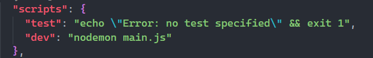

# Si no corre

Si al clonar el repo no te corre el servidor intenta instalar estas dependencias

- npm i nodemon -D 
- npm install bcrypt
- npm install jsonwebtoken
- npm install cors
- npm install pg
- npm install express
- npm init -y

# Configurar nodemon 
Te vas al archivo package.json y en la parte de scripts configuras asi: "dev": "nodemon main.js", guardas y despues en terminar ejecutas npm run dev para correr el servidor

# Configuar la base de datos para las consultas desde el servidor

1. vete a la parte de src -> controllers -> Conexion
2. configura segun el puerto, contraseña y usuario que tengas en tu base de datos y tambien el nombre que le pusiste a la base de datos

# nota:

* Para cuando vayas a guardar la informacion del reistro de un nuevo usuario el segundo nombre es opcional, la base de datos no validara el segundo nombre

# Tener en cuenta si quieres crear la base de datos sin importar el archivo que te enviare aqui esta el codigo 

CREATE TABLE roles (
    id SERIAL PRIMARY KEY,
    tipo_administracion VARCHAR(50) NOT NULL,  -- tipo de rol (por ejemplo: 'admin', 'promotor')
    descripcion TEXT  -- descripción del rol
);

CREATE TABLE usuarios_c (
    id SERIAL PRIMARY KEY,
    nombre_usuario VARCHAR(50) NOT NULL,  -- nombre de usuario (único)
    nombre_1 VARCHAR(25), 
    nombre_2 VARCHAR(25), --Segundo nombre, es opcional al momento de registro
    apellido_1 VARCHAR(25), 
    apellido_2 VARCHAR(25),  
    correo VARCHAR(50) UNIQUE NOT NULL, 
    contrasena_hash VARCHAR(255) NOT NULL,  
    fecha_registro TIMESTAMP DEFAULT CURRENT_TIMESTAMP,  
    rol_id INT,  -- clave foránea que referencia el rol del usuario
    FOREIGN KEY (rol_id) REFERENCES roles(id)  -- relación con la tabla roles
);

CREATE TABLE destinos (
    id SERIAL PRIMARY KEY,
    nombre_d VARCHAR(100) NOT NULL,  
    ubicacion VARCHAR(100),  
    descripcion TEXT, 
    fecha_creacion_d TIMESTAMP DEFAULT CURRENT_TIMESTAMP  -- fecha de creación
);

CREATE TABLE imagenes (
    id SERIAL PRIMARY KEY,
    url VARCHAR(255) NOT NULL,  
    fecha_subida TIMESTAMP DEFAULT CURRENT_TIMESTAMP,  
    destino_id INT,  -- clave foránea que referencia al destino asociado
    FOREIGN KEY (destino_id) REFERENCES destinos(id)  -- relación con la tabla destinos
);

# No tener en cuenta esta parte #

/ tabla por si acaso quiero borrar en cascada
CREATE TABLE imagenes (
    id SERIAL PRIMARY KEY,
    url VARCHAR(255) NOT NULL,
    fecha_subida TIMESTAMP DEFAULT CURRENT_TIMESTAMP,
    destino_id INT,
    FOREIGN KEY (destino_id) REFERENCES destinos(id) ON DELETE CASCADE  -- eliminación en cascada
);

CREATE TABLE eventos (
    id SERIAL PRIMARY KEY,
    titulo VARCHAR(100) NOT NULL,  -- título del evento
    descripcion TEXT,  -- descripción del evento
    fecha_inicio TIMESTAMP NOT NULL,  -- fecha de inicio del evento
    fecha_fin TIMESTAMP,  -- fecha de finalización del evento (opcional)
    usuario_id INT,  -- clave foránea al usuario que crea el evento
    destino_id INT,  -- clave foránea al destino (si aplica)
    fecha_creacion TIMESTAMP DEFAULT CURRENT_TIMESTAMP,  -- fecha de creación
    FOREIGN KEY (usuario_id) REFERENCES usuarios_c(id),
    FOREIGN KEY (destino_id) REFERENCES destinos(id)
);

/Para configurar las variables de entorno
npm install dotenv

/Para poder subir imagenes desde el frontend necesitamos un middleware
npm install multer
